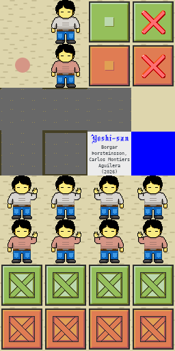
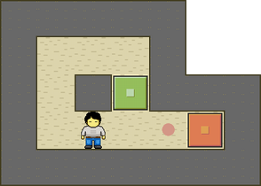

# Sokoban skin Yoshi-san

A spritesheet designed for Sokoban games.

## Details

- **Author 1:** Borgar Þorsteinsson
- **Author 2:** Carlos Montiers Aguilera
- **Creation Date:** July 31, 2026
- **License:** CC BY-SA 4.0

## Lead

I created this Sokoban skin from scratch, adapting Borgar Þorsteinsson’s 'Yoshi' skin, which was [released](https://github.com/borgar/sokoban-skins) in 2011, under the Creative Commons Attribution 3.0 license allowing modification.

Yoshi-san skin example:

## License

This work is licensed under the Creative Commons Attribution-ShareAlike 4.0 International License:
https://creativecommons.org/licenses/by-sa/4.0/
